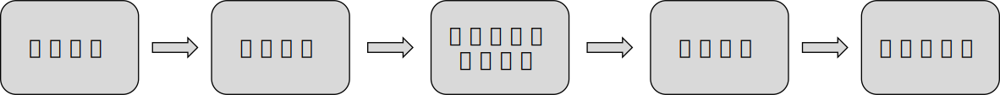

[MindSpore](https://www.mindspore.cn/tutorials/zh-CN/r2.3.0rc2/beginner/quick_start.html)

## MindSpore 数据处理

### download

```shell
pip install download
```

下载download python模块

### 引包并下载所需数据集

```python
import mindspore
from mindspore import nn
from mindspore.dataset import vision, transforms
from mindspore.dataset import MnistDataset
```

```python
# Download data from open datasets
from download import download

url = "https://mindspore-website.obs.cn-north-4.myhuaweicloud.com/" \
      "notebook/datasets/MNIST_Data.zip"
path = download(url, "./", kind="zip", replace=True)
```


下载下来MNIST_Data数据，根据官网这是一份Mnist数据集，结构如下

```
MNIST_Data
└── train
    ├── train-images-idx3-ubyte (60000个训练图片)
    ├── train-labels-idx1-ubyte (60000个训练标签)
└── test
    ├── t10k-images-idx3-ubyte (10000个测试图片)
    ├── t10k-labels-idx1-ubyte (10000个测试标签)
```

### MindSpore数据处理

```python
print(train_dataset.get_col_names())
```

打印数据集中所包含的数据列名

> MindSpore的dataset使用数据处理流水线（Data Processing Pipeline），需指定map、batch、shuffle等操作。这里我们使用map对图像数据及标签进行变换处理，将输入的图像缩放为1/255，根据均值0.1307和标准差值0.3081进行归一化处理，然后将处理好的数据集打包为大小为64的batch。

上面是官网对以下代码的处理。

其中出现了一个新名词——[归一化处理](#归一化处理)，这里使用的是Z-score normalization。

```python
def datapipe(dataset, batch_size):
    image_transforms = [
        vision.Rescale(1.0 / 255.0, 0),
        vision.Normalize(mean=(0.1307,), std=(0.3081,)),
        vision.HWC2CHW()
    ]
    label_transform = transforms.TypeCast(mindspore.int32)

    dataset = dataset.map(image_transforms, 'image')
    dataset = dataset.map(label_transform, 'label')
    dataset = dataset.batch(batch_size)
    return dataset


# Map vision transforms and batch dataset
train_dataset = datapipe(train_dataset, 64)
test_dataset = datapipe(test_dataset, 64)
```

---

可使用[create_tuple_iterator](https://www.mindspore.cn/docs/zh-CN/r2.2/api_python/dataset/dataset_method/iterator/mindspore.dataset.Dataset.create_tuple_iterator.html) 或[create_dict_iterator](https://www.mindspore.cn/docs/zh-CN/r2.2/api_python/dataset/dataset_method/iterator/mindspore.dataset.Dataset.create_dict_iterator.html)对数据集进行迭代访问，查看数据和标签的shape和datatype。

```python
for image, label in test_dataset.create_tuple_iterator():
    print(f"Shape of image [N, C, H, W]: {image.shape} {image.dtype}")
    print(f"Shape of label: {label.shape} {label.dtype}")
    break
```

>Shape of image [N, C, H, W]: (64, 1, 28, 28) Float32
>Shape of label: (64,) Int32

```python
for data in test_dataset.create_dict_iterator():
    print(f"Shape of image [N, C, H, W]: {data['image'].shape} {data['image'].dtype}")
    print(f"Shape of label: {data['label'].shape} {data['label'].dtype}")
    break
```

> Shape of image [N, C, H, W]: (64, 1, 28, 28) Float32
> Shape of label: (64,) Int32

更多细节详见[数据集 Dataset](https://www.mindspore.cn/tutorials/zh-CN/r2.2/beginner/dataset.html)与[数据变换 Transforms](https://www.mindspore.cn/tutorials/zh-CN/r2.2/beginner/transforms.html)。

### 网络构建

```python
# Define model
class Network(nn.Cell):
    def __init__(self):
        super().__init__()
        self.flatten = nn.Flatten()
        self.dense_relu_sequential = nn.SequentialCell(
            nn.Dense(28*28, 512),
            nn.ReLU(),
            nn.Dense(512, 512),
            nn.ReLU(),
            nn.Dense(512, 10)
        )

    def construct(self, x):
        x = self.flatten(x)
        logits = self.dense_relu_sequential(x)
        return logits

model = Network()
print(model)
```

> Network<
>   (flatten): Flatten<>
>   (dense_relu_sequential): SequentialCell<
>     (0): Dense<input_channels=784, output_channels=512, has_bias=True>
>     (1): ReLU<>
>     (2): Dense<input_channels=512, output_channels=512, has_bias=True>
>     (3): ReLU<>
>     (4): Dense<input_channels=512, output_channels=10, has_bias=True>
>     >

以上为网格的构建以及其输出，有以下几点需要注意

1. 上面重命名过MindSpore中的nn类是构建所有网格的基类，也是网格的基本单元
2. 当需要自定义网络时可以重写``nn.Cell`类重写`__init__`方法和`construct`方法
3. `__init__`包含所有网络层的定义`construct`中包含数据（[Tensor](https://www.mindspore.cn/tutorials/zh-CN/r2.2/beginner/tensor.html)）的变换过程

> `mindspore.nn`类是构建所有网络的基类，也是网络的基本单元。当用户需要自定义网络时，可以继承`nn.Cell`类，并重写`__init__`方法和`construct`方法。`__init__`包含所有网络层的定义，`construct`中包含数据（[Tensor](https://www.mindspore.cn/tutorials/zh-CN/r2.2/beginner/tensor.html)）的变换过程。

### 模型训练

个人菜狗形象的想，实际上这里的网格神经网络对图像的识别类似一种带指向的可变哈希函数（只不过这个函数的实现比较复杂和通用）。他是从大量信息到小量准确抽象的描述过程。下面是[3.2. 机器学习工作流 — 机器学习系统：设计和实现 1.0.0 documentation (openmlsys.github.io)](https://openmlsys.github.io/chapter_programming_interface/ml_workflow.html)手册上的机器学习流程图，这里以求形象的理解



> 在模型训练中，一个完整的训练过程（step）需要实现以下三步：
>
> 1. **正向计算**：模型预测结果（logits），并与正确标签（label）求预测损失（loss）。
> 2. **反向传播**：利用自动微分机制，自动求模型参数（parameters）对于loss的梯度（gradients）。
> 3. **参数优化**：将梯度更新到参数上。

> MindSpore使用函数式自动微分机制，因此针对上述步骤需要实现：
>
> 1. 定义正向计算函数。
> 2. 使用[value_and_grad](https://www.mindspore.cn/docs/zh-CN/r2.2/api_python/mindspore/mindspore.value_and_grad.html)通过函数变换获得梯度计算函数。
> 3. 定义训练函数，使用[set_train](https://www.mindspore.cn/docs/zh-CN/r2.2/api_python/nn/mindspore.nn.Cell.html#mindspore.nn.Cell.set_train)设置为训练模式，执行正向计算、反向传播和参数优化。

```python
# Instantiate loss function and optimizer
loss_fn = nn.CrossEntropyLoss()
optimizer = nn.SGD(model.trainable_params(), 1e-2)

# 1. Define forward function
def forward_fn(data, label):
    logits = model(data)
    loss = loss_fn(logits, label)
    return loss, logits

# 2. Get gradient function
grad_fn = mindspore.value_and_grad(forward_fn, None, optimizer.parameters, has_aux=True)

# 3. Define function of one-step training
def train_step(data, label):
    (loss, _), grads = grad_fn(data, label)
    optimizer(grads)
    return loss

def train(model, dataset):
    size = dataset.get_dataset_size()
    model.set_train()
    for batch, (data, label) in enumerate(dataset.create_tuple_iterator()):
        loss = train_step(data, label)

        if batch % 100 == 0:
            loss, current = loss.asnumpy(), batch
            print(f"loss: {loss:>7f}  [{current:>3d}/{size:>3d}]")
```

> 除训练外，我们定义测试函数，用来评估模型的性能。

```python
def test(model, dataset, loss_fn):
    num_batches = dataset.get_dataset_size()
    model.set_train(False)
    total, test_loss, correct = 0, 0, 0
    for data, label in dataset.create_tuple_iterator():
        pred = model(data)
        total += len(data)
        test_loss += loss_fn(pred, label).asnumpy()
        correct += (pred.argmax(1) == label).asnumpy().sum()
    test_loss /= num_batches
    correct /= total
    print(f"Test: \n Accuracy: {(100*correct):>0.1f}%, Avg loss: {test_loss:>8f} \n")
```

> 训练过程需多次迭代数据集，一次完整的迭代称为一轮（epoch）。在每一轮，遍历训练集进行训练，结束后使用测试集进行预测。打印每一轮的loss值和预测准确率（Accuracy），可以看到loss在不断下降，Accuracy在不断提高。

```python
epochs = 3
for t in range(epochs):
    print(f"Epoch {t+1}\n-------------------------------")
    train(model, train_dataset)
    test(model, test_dataset, loss_fn)
print("Done!")
```

>```
>Epoch 1
>-------------------------------
>loss: 2.302088  [  0/938]
>loss: 2.290692  [100/938]
>loss: 2.266338  [200/938]
>loss: 2.205240  [300/938]
>loss: 1.907198  [400/938]
>loss: 1.455603  [500/938]
>loss: 0.861103  [600/938]
>loss: 0.767219  [700/938]
>loss: 0.422253  [800/938]
>loss: 0.513922  [900/938]
>Test:
> Accuracy: 83.8%, Avg loss: 0.529534
>
>Epoch 2
>-------------------------------
>loss: 0.580867  [  0/938]
>loss: 0.479347  [100/938]
>loss: 0.677991  [200/938]
>loss: 0.550141  [300/938]
>loss: 0.226565  [400/938]
>loss: 0.314738  [500/938]
>loss: 0.298739  [600/938]
>loss: 0.459540  [700/938]
>loss: 0.332978  [800/938]
>loss: 0.406709  [900/938]
>Test:
> Accuracy: 90.2%, Avg loss: 0.334828
>
>Epoch 3
>-------------------------------
>loss: 0.461890  [  0/938]
>loss: 0.242303  [100/938]
>loss: 0.281414  [200/938]
>loss: 0.207835  [300/938]
>loss: 0.206000  [400/938]
>loss: 0.409646  [500/938]
>loss: 0.193608  [600/938]
>loss: 0.217575  [700/938]
>loss: 0.212817  [800/938]
>loss: 0.202862  [900/938]
>Test:
> Accuracy: 91.9%, Avg loss: 0.280962
>
>Done!
>```

> 训练过程需多次迭代数据集，一次完整的迭代称为一轮（epoch）。在每一轮，遍历训练集进行训练，结束后使用测试集进行预测。打印每一轮的loss值和预测准确率（Accuracy），可以看到loss在不断下降，Accuracy在不断提高。

### 保存模型

模型训练完成后，需要将其参数进行保存。

```python
# Save checkpoint
mindspore.save_checkpoint(model, "model.ckpt")
print("Saved Model to model.ckpt")
```

> Saved Model to model.ckpt

### 加载模型

> 加载保存的权重分为两步：
>
> 1. 重新实例化模型对象，构造模型。
> 2. 加载模型参数，并将其加载至模型上。

```python
# Instantiate a random initialized model
model = Network()
# Load checkpoint and load parameter to model
param_dict = mindspore.load_checkpoint("model.ckpt")
param_not_load, _ = mindspore.load_param_into_net(model, param_dict)
print(param_not_load)
```

> `param_not_load未被加载的参数列表，为空时代表所有参数均加载成功。`

> 加载后的模型可以直接用于预测推理。

```python
model.set_train(False)
for data, label in test_dataset:
    pred = model(data)
    predicted = pred.argmax(1)
    print(f'Predicted: "{predicted[:10]}", Actual: "{label[:10]}"')
    break
```

以上就是一个简单的图像识别机械学习

**注意在加载模型的过程中必须定义模型构建与datapipe**

## 归一化处理

> 一些传送门：
> [归一化基础知识点 — PaddleEdu documentation (paddlepedia.readthedocs.io)](https://paddlepedia.readthedocs.io/en/latest/tutorials/deep_learning/normalization/basic_normalization.html)
>
> [Numpy数组归一化|极客教程 (geek-docs.com)](https://geek-docs.com/numpy/numpy-ask-answer/normalize-numpy-array_z1.html)

归一化是一种数据处理方式，能将数据经过处理后限制在某个固定范围内。

### 归一化处理的两种形式

归一化存在两种形式

1. 将数处理为 [0, 1] 之间的小数，其目的是为了在随后的数据处理过程中更便捷，其他情况下，也可将数据处理到 [-1, 1] 之间，或其他的固定范围内。

> 例如，在图像处理中，就会将图像从 [0, 255] 归一化到 [0, 1]之间，这样既不会改变图像本身的信息储存，又可加速后续的网络处理。

2. 通过归一化将有[量纲表达式](#有/无量纲表达式)变成[无量纲表达式](#有/无量纲表达式)。

### 为什么要进行归一化

1. 解决数据间的可比性问题
2. 数据归一化后，寻求最优解的过程会变得平缓，可以更快速的收敛到最优解。[为什么能提高收敛速度](为什么归一化能提高求解最优解的速度).

### 归一化类型

1. Min-max normalization (Rescaling) 范围为[0,1]:

$$
x^{'} = \frac{x - min(x)}{max(x) - min(x)}
$$

2. Mean normalization范围为[-1,1]：

$$
x^{'} = \frac{x - mean(x)}{max(x) - min(x)}
$$

> mean(x)：x数据的平均值

​	Min-max归一化和mean归一化适合在最大最小值明确不变的情况下使用，比如图像处理时，灰度值限定在 [0, 255] 的范围内，就可以用min-max归一化将其处理到[0, 1]之间。在最大最小值不明确时，每当有新数据加入，都可能会改变最大或最小值，导致归一化结果不稳定，后续使用效果也不稳定。同时，数据需要相对稳定，如果有过大或过小的异常值存在，min-max归一化和mean归一化的效果也不会很好。如果对处理后的数据范围有严格要求，也应使用min-max归一化或mean归一化。

3. Z-score normalization (Standardization)范围为实数集：

$$
x^{'} = \frac{x - \mu}{\sigma}
$$

> 𝜇、𝜎 分别为样本数据的均值和标准差。

​	Z-score归一化也可称为标准化，经过处理的数据呈均值为0，标准差为1的分布。在数据存在异常值、最大最小值不固定的情况下，可以使用标准化。标准化会改变数据的状态分布，但不会改变分布的种类。特别地，神经网络中经常会使用到z-score归一化，针对这一点，我们将在后续的文章中进行详细的介绍。

4. 对数归一化：

$$
x^{'} = \frac{\lg x}{\lg max(x)}
$$

5. 反正切函数归一化：

$$
x^{'} = \arctan(x) * \frac{2}{\pi}
$$

6. 小数定标标准化（Demical Point Normalization）:

$$
x^{'} = \frac{x}{10^j}
$$

​	非线性归一化通常被用在数据分化程度较大的场景，有时需要通过一些数学函数对原始值进行映射，如对数、反正切等。

### 归一化和标准化的联系与区别

谈到归一化和标准化可能会存在一些概念的混淆，我们都知道归一化是指normalization，标准化是指standardization，但根据wiki上对feature scaling方法的定义，standardization其实就是z-score normalization，也就是说标准化其实是归一化的一种，而一般情况下，我们会把z-score归一化称为标准化，把min-max归一化简称为归一化。在下文中，我们也是用标准化指代z-score归一化，并使用归一化指代min-max归一化。

其实，归一化和标准化在本质上都是一种线性变换。在[归一化类型](#归一化类型)中，我们提到了归一化和标准化的公式，对于归一化的公式，在数据给定的情况下，可以令𝑎=𝑚𝑎𝑥(𝑥)−𝑚𝑖𝑛(𝑥)、𝑏=𝑚𝑖𝑛(𝑥)，则归一化的公式可变形为：
$$
x^{'} = \frac{x - b}{a} = \frac{x}{a} - \frac{b}{a} = \frac{x}{a} - c
$$
标准化的公式与变形后的归一化类似，其中的$\mu $和$\sigma$在数据给定的情况下，可以看作常数。因此，标准化的变形与归一化的类似，都可看作对𝑥按比例𝑎进行缩放，再进行𝑐个单位的平移。由此可见，归一化和标准化的本质都是一种线性变换，他们都不会因为对数据的处理而改变数据的原始数值排序。

那么归一化和标准化又有什么区别呢？

1. 归一化不会改变数据的状态分布，但标准化会改变数据的状态分布；
2. 归一化会将数据限定在一个具体的范围内，如 [0, 1]，但标准化不会，标准化只会将数据处理为均值为0，标准差为1。

### 为什么归一化能提高求解最优解的速度

$$
\begin{split}
\begin{align}
y &= \theta_1x_1 + \theta_2x_2 \\
J &= (\theta_{1}x_{1} + \theta_{2}x_{2} - y_{label})^2
\end{align}
\end{split}
$$

假设自变量只有房子到地铁站的距离$$𝑥_1$$和房子内房间的个数$$𝑥_2$$，因变量为房价，预测公式和损失函数分别为：

$$
J = (1000\theta_{1}+3\theta_{2} - y_{label})^2
$$


<div align="center">图1: 损失函数的等高线，图1（左）为未归一化时，图1（右）为归一化</div>

​	在图1中，左图的红色椭圆代表归一化前的损失函数等高线，蓝色线段代表梯度的更新，箭头的方向代表梯度更新的方向。寻求最优解的过程就是梯度更新的过程，其更新方向与登高线垂直。由于𝑥1 和 𝑥2 的量级相差过大，损失函数的等高线呈现为一个瘦窄的椭圆。因此如图1（左）所示，瘦窄的椭圆形会使得梯度下降过程呈之字形呈现，导致梯度下降速度缓慢。

​	当数据经过归一化后，$x_{1}^{'} = \frac{1000-0}{5000-0}=0.2$，$x_{2}^{'} = \frac{3-0}{10-0}=0.3$，那么损失函数的公式可以写为：
$$
J(x) = (0.2\theta_{1} + 0.3\theta_{2} - y_{label})^2
$$
​	我们可以看到，经过归一化后的数据属于同一量级，损失函数的等高线呈现为一个矮胖的椭圆形（如图1（右）所示），求解最优解过程变得更加迅速且平缓，因此可以在通过梯度下降进行求解时获得更快的收敛。

## 有/无量纲表达式

我们假定数据都是一个个变量（不过提前收集好了）量纲指有些未知数他们是变量存在的一种或几种依赖关系，该变量的值由这些依赖关系的未知数（量纲）决定。

>  就像一些函数的y值，理想状态下的房价，他们由x，面积/位置决定。

显然位置差几百米，面积差几百平方米对变量影响差距极大，这种情况下我们称对这些依赖关系式是有量纲的。他们对变量影响的系数存在数量级的不同。

## 常见问题

1. vscode 出现python解释器的选择错误，这在windows经常有非常多版本的相同软件上经常出现，选定安装MindSpore库的python版本


​	点击此处python版本即可

2. 注意python的多数语法检查集成已分离为插件，一些在2023.10发布，发布后一些网络上的blog修改linting的将禁用，详情请看[迁移到 Python 工具扩展 ·microsoft/vscode-python 维基 (github.com)](https://github.com/microsoft/vscode-python/wiki/Migration-to-Python-Tools-Extensions)

3. 解决一些格式上的报错也可以不理会，但根据PEP 8 python规范，一行不能超过80个字符，同时换行需要缩进,如果看不管可以在扩展语法检查中增加args

```
--max-line-length=120
```

